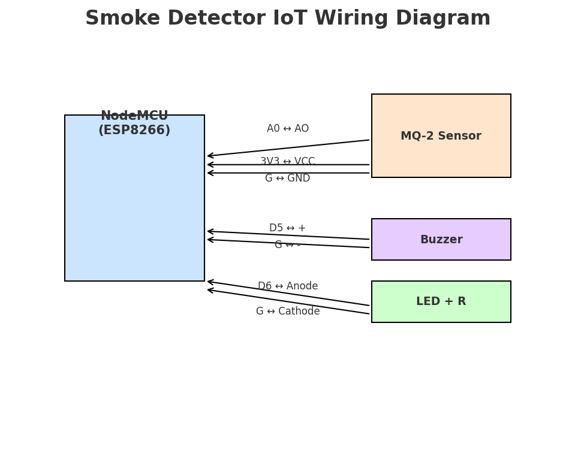

# Smoke Detector Using IoT 🚨

IoT-based smoke & gas detection system using ESP8266 + MQ-2 sensor, publishing to Adafruit IO, with a Python client for logging and alerts.

## Features
- Real-time smoke/gas monitoring with MQ-2
- Publishes data to Adafruit IO (MQTT)
- Local buzzer + LED alarm
- Python client logs data & shows desktop notifications

## Setup
1. Flash `firmware/esp8266_mq2_smoke_detector.ino` with Arduino IDE.
2. Install Python requirements: `pip install paho-mqtt plyer`
3. Run `python client/monitor_client.py`

## Repo Structure
```
smoke-detector-iot/
├── firmware/
│   └── esp8266_mq2_smoke_detector.ino
├── client/
│   └── monitor_client.py
├── docs/
├── .gitignore
└── README.md
```
## Wiring Diagram

